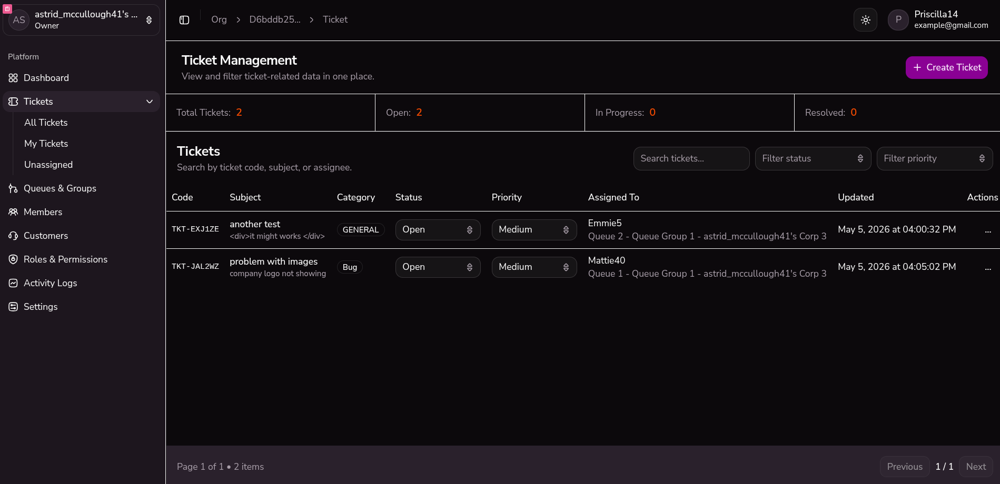
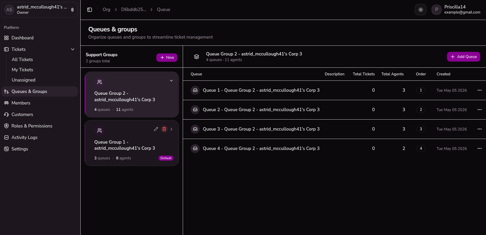
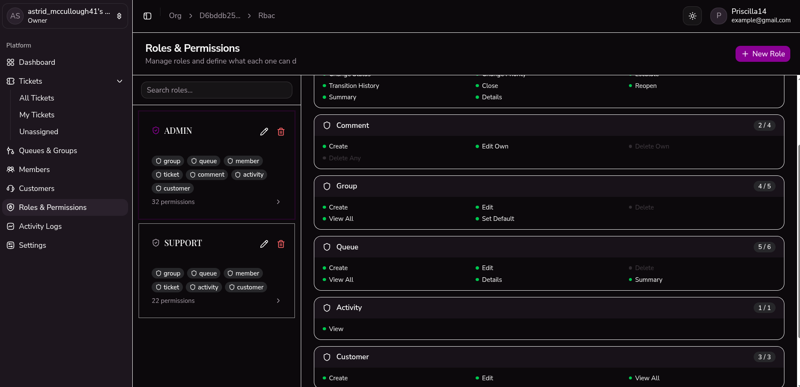

# Ticket Flow

## Overview

A full-stack ticket management system built to handle issue tracking, role-based workflows,and organization tenet system

This project focuses on scalable backend architecture, clean separation of concerns, and efficient data handling.

---

## Features

- Role-based access control (Admin, Agent, User)
- Ticket lifecycle management (Open → In Progress → Resolved → Closed)
- Comment system for ticket discussions
- email provider integration
- Structured API with validation and error handling
- Multi-tenant Organization support

---

## Tech Stack

- Backend: Express + TypeScript
- Frontend: React , zustand, tailiwndcss
- Database: PostgreSQL with Prisma
- Architecture: modular stricture

---

## Architecture Overview

The system follows a layered architecture:

- Controllers handle request/response
- Services contain business logic
- Prisma manages database access

This separation allows better scalability and maintainability.

Detailed architecture: [Architecture docs](./docs/architecture.md)

---

## Key Design Decisions

### 1. Service Layer Abstraction

Business logic is separated from controllers to keep routes clean and reusable.

### 2. Prisma ORM

Used for type safety and faster development, reducing runtime query errors.

### 3. Role-Based Authorization

Middleware-based role checks ensure secure access control across endpoints.

### 4. Organization based structure

---

## Each user can create there own organization and join other as member

## Trade-offs

- Did not implement microservices to keep deployment simple
- Did not add real time webhook notification
- Limited caching to reduce system complexity
- Focused on backend strength over UI polish

- authentication is manual (auth + refresh token)
- email servers is integrated inside app

---

## API Reference

See: [API docs](./docs/api.md)

---

## Database Design

See [database docs](./docs/database.md)

## Screen shorts

Ticket management


Queue and Groups


RBAC system



## Running Locally

### 1. Rapid Deployment (Docker)

Use this method to spin up the entire stack (Frontend, Backend, and Database) in a containerized environment.

1. **Configure Environment:**

   ```bash
   cp .env.example .env
   ```

2. \*_Launch Containers:_ _Note: This command initializes three orchestrated containers. Once healthy, the application is accessible at `http://localhost` (Port 80)._

---

### 2. Local Development Mode

Use this method if you want to make active code changes with Hot Module Replacement (HMR).

#### **Backend Setup**

1. **Environment:** Create a `.env` file in the `/backend` directory using `.env.example` as a template.
2. **Dependencies:** Run `pnpm install` in the root or backend folder.
3. **Database:** Ensure you have a local **PostgreSQL** server running.
4. **Prisma Initialization:**

   ```bash
   pnpm run generate       # Generates Prisma Client
   pnpm run migrate        # Syncs database schema
   ```

5. Create a dev role for runtime , it support row level security

   ```bash
   pnpm run db:setup
   ```

#### **Execution**

Run the following command from the **root directory**:

```bash
pnpm run dev
```

> **Default Port Mapping:**
>
> - **Backend:** Runs on port `3000` (unless specified otherwise in `.env`).
> - **Frontend:** Launches on port `5173` (or your configured Vite/Next.js port).
> - **Database:** Default PostgreSQL connection usually occupies port `5432`.

---

### License

This project is licensed under the MIT License.
